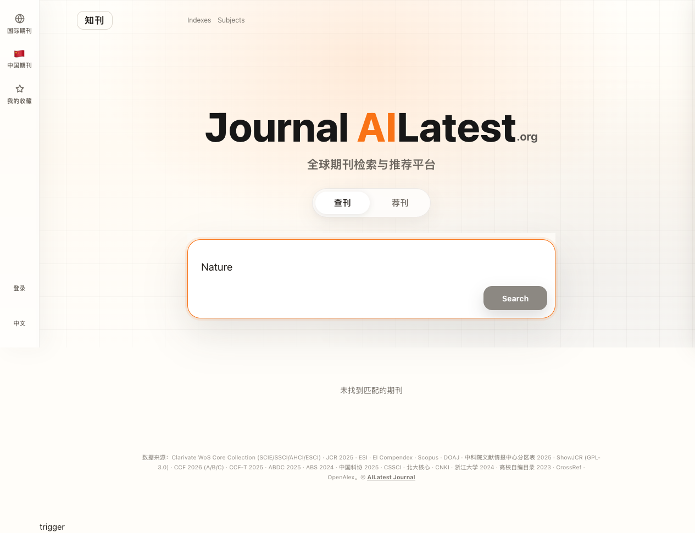

<div align="center">
  <h1>
    
    AILatest Journal · 知刊
  </h1>
  <p>
    <strong>全球学术期刊检索与推荐平台</strong><br>
    <em>The most comprehensive free journal finder &amp; recommendation platform for academic researchers</em>
  </p>
  <p>
    <a href="https://journal.ailatest.org">🌐 journal.ailatest.org</a> ·
    <a href="https://ailatest.org">📰 ailatest.org</a>
  </p>
  <p>
    <a href="https://journal.ailatest.org">
      
    </a>
  </p>
  <p>
    <a href="https://github.com/stonecanon/ailatest-journal/actions"></a>
    <a href="https://journal.ailatest.org"></a>
    <a href="https://opensource.org/licenses/MIT"></a>
  </p>
</div>

---

**AILatest Journal (知刊)** 是一个免费、开源的学术期刊检索与推荐平台，收录 **44,844 本**国际期刊，覆盖 **SCIE / SSCI / AHCI / ESCI / EI / Scopus / DOAJ / MEDLINE** 等主流索引，提供影响因子、中科院/JCR分区、审稿周期、预警信息等关键投稿指标。

纯前端 SPA，数据全部客户端搜索，毫秒级响应。无需后端服务器，部署于 Cloudflare Pages。

---

## ✨ 核心功能

| 功能 | Feature | 说明 |
|------|---------|------|
| 🔍 **期刊检索** | Search | 全称/缩写/ISSN 实时搜索，多维度筛选（索引、分区、学科、状态），毫秒级响应 |
| 🎯 **智能荐刊** | Pick for Me | 输入论文标题/摘要，AI 算法自动推荐最匹配的目标期刊 |
| ⭐ **收藏同步** | Favorites | 登录后跨设备收藏同步，管理投稿清单 |
| 🏛️ **期刊详情** | Details | IF 趋势图、中科院/JCR 分区、审稿周期、OA/APC、OpenAlex Topics |
| 🌐 **多语言** | i18n | 中/英/日/韩/西/葡/法/德 8 种语言 |
| 📱 **PWA 支持** | PWA | 可安装到手机主屏，离线基本可用 |
| ⚠️ **预警监控** | Warnings | 中科院预警名单、中信所预警、WoS On Hold、Under Review 实时标记 |

---

## 📊 数据统计

### 覆盖范围

| 指标 | Metric | 数量 |
|------|--------|-----:|
| **总期刊数** | **Total journals** | **44,844** |
| 🟢 **SCIE** | Science Citation Index Expanded | **9,527** |
| 🟡 **SSCI** | Social Sciences Citation Index | **3,557** |
| 🔵 **AHCI** | Arts & Humanities Citation Index | **1,819** |
| 🟣 **ESCI** | Emerging Sources Citation Index | **9,449** |
| 🟠 **EI** | Engineering Index (Compendex) | **4,503** |
| 📘 **Scopus** | Scopus (无 WoS 覆盖) | **30,445** |
| 📗 **DOAJ** | Directory of Open Access Journals | **21,395** |
| 📕 **MEDLINE** | MEDLINE Indexed | **7,181** |

### 期刊指标

| 指标 | Metric | 数量 |
|------|--------|-----:|
| 有 JCR IF 2024 | With Impact Factor | **21,525** |
| JCR 分区 | JCR Quartile | **22,247** |
| 中科院分区 | CAS Zone | **21,695** |
| 中科院大类 | CAS Major Category | **21,733** |
| ESI 学科 | ESI 22 Categories | **12,272** |
| WoS 学科 | WoS Subject Categories | **22,929** |
| 审稿周期 | Review Cycle Data | **5,363** |
| ABDC (澳大利亚) | ABDC 2024 | **2,651** |
| ABS (英国) | ABS 2024 | **1,822** |
| CCF 推荐 | CCF 2026 | **279** |
| CNKI 核心 | CNKI Major Chinese Journals | **1,202** |

### 预警与异常状态

| 状态 | Status | 数量 |
|------|--------|-----:|
| 🟠 中科院预警 | CAS Warning List 2025 | **105** |
| 🔴 中信所预警 | CITIC Warning List | **39** |
| 🟡 On Hold (WoS) | WoS On Hold | **15** |
| ⏸️ Under Review | Under Review (topeditsci) | **44** |

---

## 🎯 智能荐刊 — Pick for Me

<div align="center">
  <table>
    <tr>
      <td><a href="https://journal.ailatest.org"></a></td>
      <td><a href="https://journal.ailatest.org"></a></td>
    </tr>
  </table>
</div>

输入论文标题或摘要，系统自动：
1. 提取关键词，多维度搜索 OpenAlex
2. 按期刊聚合论文，多因子打分（论文数 60% + 关键词匹配 30% + Topic 匹配 10%）
3. IF 筛选、分区过滤、排除综合性期刊等条件叠加
4. 推荐最匹配的目标期刊，附带审稿周期数据

---

## 🏛️ 期刊详情抽屉

<div align="center">
  <a href="https://journal.ailatest.org"></a>
</div>

每个期刊的详情抽屉包含：
- **索引标识**: SCIE / SSCI / AHCI / ESCI / EI / Scopus / MEDLINE / DOAJ
- **分区信息**: 中科院 2025 大类分区 + TOP 标志、JCR Quartile
- **指标**: JCR 2024 影响因子 (IF)、Eigenfactor、排名百分位
- **学科分类**: ESI 22 大类、WoS 细分学科
- **核心信息**: ISSN、EISSN、出版商、语种、出版周期
- **OA 信息**: 开放获取状态、APC 费用、DOAJ 认证
- **预警标记**: 中科院预警、中信所预警、WoS On Hold、Under Review
- **学术评价**: CCF、ABDC、ABS 分级
- **审稿周期**: CrossRef 数据推导的平均审稿周期
- **OpenAlex Topics**: 主要研究领域标签

---

## 📋 数据来源

| 数据 | Data Source | 说明 |
|------|-------------|------|
| WoS 五大索引 | Clarivate 公开列表 | SCIE/SSCI/AHCI/ESCI, 定期更新 |
| JCR 指标 | [ShowJCR](https://github.com/hitfyd/ShowJCR) (GPL-3.0) | IF 2024、JCR Quartile、Eigenfactor |
| 中科院分区 | ShowJCR | 2025 大类分区 (1-4 区, TOP 标志) |
| EI Compendex | Elsevier 公开列表 | 2025 年版 |
| Scopus | Elsevier 公开列表 | 自动月度更新（cron job） |
| ESI 22 学科 | 高校图书馆公开发布 | 12,272 本期刊匹配 |
| DOAJ | Directory of Open Access Journals | 21,395 本 OA 期刊 |
| 审稿周期 | CrossRef + 自收集 | 5,363 个期刊实测数据 |
| CCF 推荐 | 中国计算机学会 | 2026 版 A/B/C |
| ABDC | Australian Business Deans' Council | 2025 版 A*/A/B/C |
| ABS | Chartered ABS | Academic Journal Guide 2024 |
| 预警名单 | 中科院文献情报中心 | 2025 版 105 条 |
| 中信所预警 | 中信所 | 39 条预警期刊 |
| Under Review | [topeditsci](https://topeditsci.com) | 44 本考察期期刊 |
| On Hold | Clarivate / 自跟踪 | 15 本月刊 |
| OpenAlex | OpenAlex API | Topics、OA、APC 元数据 |
| CNKI 中文期刊 | 知网 | 1,202 种中文核心期刊 |

---

## 🛠️ 技术栈

| 技术 | Tech | 用途 |
|------|------|------|
| **HTML/CSS/JS** | Vanilla SPA | 零框架，纯原生实现 |
| **Python** | Pandas, openpyxl | 数据清洗、合并、构建 |
| **Cloudflare Pages** | Edge CDN | 全球部署，零服务器 |
| **GitHub → CF** | Auto Deploy | CI/CD 自动发布 |
| **Hermes Agent** | Cron Jobs | Scopus/DOAJ 月度自动更新 |
| **PWA** | Service Worker | 离线缓存、主屏安装 |

---

## 🚀 本地开发

```bash
# 1. 克隆
git clone https://github.com/stonecanon/ailatest-journal.git
cd ailatest-journal

# 2. 构建数据（需 Python 3）
python3 scripts/build_journals.py

# 3. 本地预览
python3 -m http.server 8080
# 浏览器打开 http://localhost:8080
```

---

## 📁 项目结构

```
├── index.html              # SPA 主入口
├── css/app.css             # 样式（~5,400 行）
├── js/app.js               # 逻辑（IIFE, ~5,000 行）
├── scripts/
│   ├── build_journals.py   # 数据构建流水线
│   ├── fetch_openalex.py   # OpenAlex 数据抓取
│   └── merge_openalex.py   # OpenAlex 合并
├── data/                   # 构建产物（JSON/GZ）
├── screenshots/            # README 截图
├── icons/                  # PWA 图标 + OG 图
├── functions/api/          # Cloudflare Pages Functions（搜索 API）
├── weapp/                  # 微信小程序（预留）
├── robots.txt              # SEO
└── sitemap.xml             # SEO
```

---

## 📄 协议与声明

- WoS 数据来自 Clarivate 公开发布列表
- JCR/中科院/预警数据来自 [ShowJCR](https://github.com/hitfyd/ShowJCR)（GPL-3.0）
- 代码采用 **MIT License**，欢迎自由使用和贡献
- 如有收录争议或下架请求，请提 [GitHub Issue](https://github.com/stonecanon/ailatest-journal/issues)

---

<div align="center">
  <p>
    <a href="https://journal.ailatest.org">🔍 开始查询 → journal.ailatest.org</a>
  </p>
  <p>
    <sub>
      Built by <a href="https://github.com/stonecanon">stonecanon</a> ·
      <a href="https://ailatest.org">ailatest.org</a>
    </sub>
  </p>
</div>
