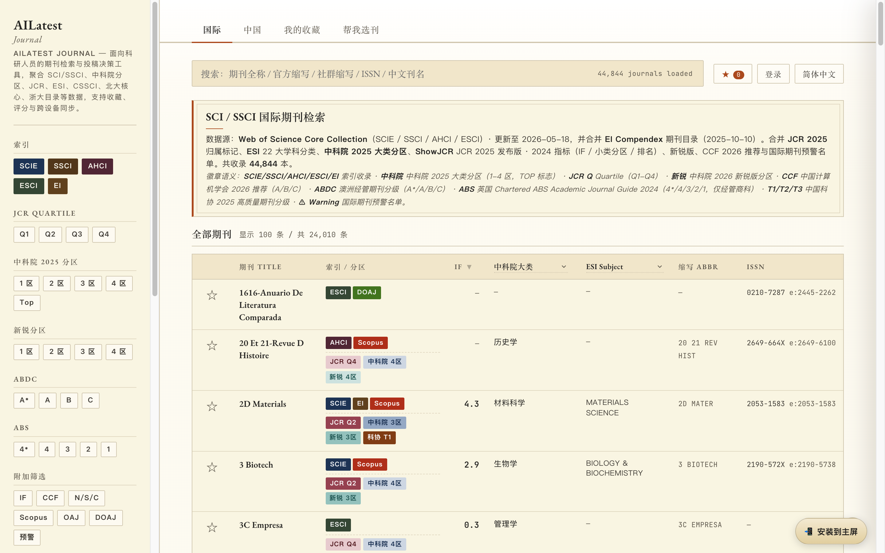
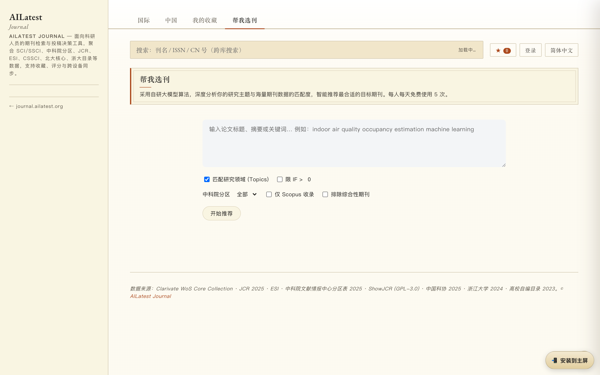
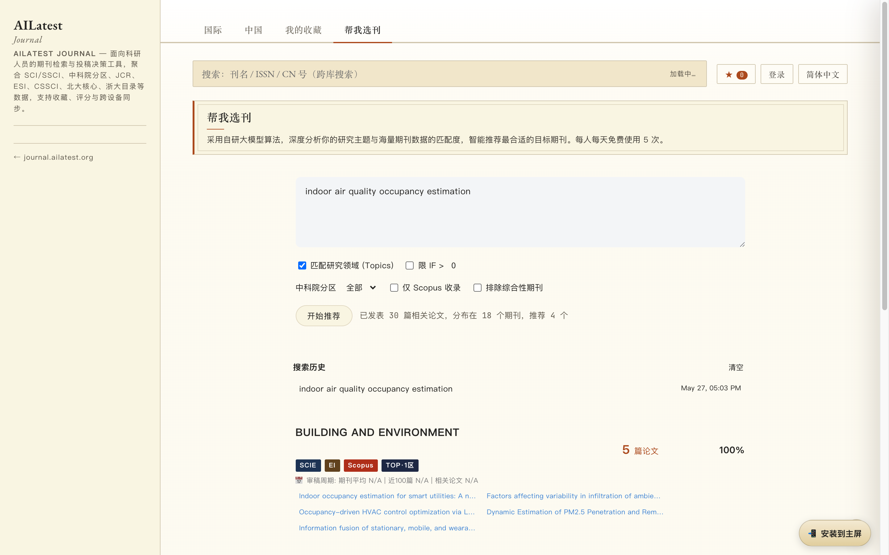

<div align="center">
  <h1>AILatest Journal</h1>
  <p>
    <strong>最全面的免费期刊查询与选刊推荐平台</strong><br>
    <em>The most comprehensive free journal finder &amp; recommendation tool for researchers</em>
  </p>
  <p>
    <a href="https://journal.ailatest.org">🌐 journal.ailatest.org</a> ·
    <a href="https://ailatest.org">🏠 ailatest.org</a>
  </p>
  <p>
    <a href="https://journal.ailatest.org"></a>
  </p>
</div>

---

## ✨ Features

| 功能 | Feature | 说明 |
|------|---------|------|
| 🔍 **期刊检索** | Journal Search | 支持全称/缩写/ISSN/中文刊名实时搜索，本地全内存过滤，毫秒级响应 |
| 🎯 **帮我选刊** | Pick for Me | 输入论文标题/摘要，AI 算法自动推荐最匹配的目标期刊 |
| ⭐ **收藏同步** | Favorites Sync | 收藏期刊列表，登录后跨设备自动同步 |
| 🏛️ **期刊详情** | Journal Details | 查看 IF、中科院分区、JCR 分区、ESI 分类、审稿周期、OA 信息等 |
| 🌐 **多语言** | Multi-language | 中文 / English / 繁體中文 / 日本語 / 한국어 / Español / Português / Français |
| 🌙 **深色模式** | Dark Mode | 自动跟随系统主题，手动切换 |

## 📊 Data Statistics

| Metric | Count |
|--------|------:|
| **Total journals** | **44,844** |
| SCIE | 9,527 |
| SSCI | 3,557 |
| AHCI | 1,819 |
| ESCI | 9,449 |
| EI Compendex | 4,503 |
| Scopus | 29,817 |
| DOAJ | 21,395 |
| With IF (JCR 2024) | 21,525 |
| CAS Zones | 19,695 |
| CCF Recommended | 279 |
| CSSCI | ~900 |
| PKU Core | ~2,000 |
| ABDC (Aus.) | 2,651 |
| ABS (UK) | 1,822 |
| Warning List | 105 |
| CNKI Major (中文) | 11,609 |
| CAST Tiered (科协) | 8,626 |
| Review Cycles | 2,492 |

## 🎯 Pick for Me — AI Journal Recommendation

<div align="center">
  <table>
    <tr>
      <td><a href="https://journal.ailatest.org"></a></td>
      <td><a href="https://journal.ailatest.org"></a></td>
    </tr>
  </table>
</div>

输入论文标题或摘要，系统自动:
1. 提取关键词，多维度搜索 OpenAlex
2. 按期刊聚合论文，多因子打分（论文数量 60% + 关键词匹配 30% + Topic 匹配 10%）
3. 综合 IF 筛选、分区过滤、排除综合性期刊等条件
4. 推荐最匹配的目标期刊，附带审稿周期数据

## 🏛️ Journal Detail Drawer

<div align="center">
  <a href="https://journal.ailatest.org"></a>
</div>

每个期刊可展开详情抽屉，包含:
- **索引标识**: SCIE / SSCI / AHCI / ESCI / EI
- **分区信息**: 中科院 2025 大类分区 + TOP 标志、JCR Quartile、新锐版分区
- **指标**: JCR 2024 影响因子 (IF)
- **学科分类**: ESI 22 大类、WoS 细分学科
- **核心信息**: ISSN、出版商、语种、出版周期
- **OA 信息**: 开放获取状态、APC 费用
- **预警标记**: 国际期刊预警名单
- **中国数据**: CSSCI、北大核心、浙江大学 2024 分级、CCF 中文推荐
- **审稿周期**: 基于 CrossRef 数据的期刊平均审稿周期
- **OpenAlex Topics**: 主要研究领域标签

## 📋 Data Sources

| 数据 | 来源 | 说明 |
|------|------|------|
| WoS 四大索引 | Clarivate 公开列表 | SCIE/SSCI/AHCI/ESCI, 更新至 2026-04-20 |
| JCR 指标 | [ShowJCR](https://github.com/hitfyd/ShowJCR) (GPL-3.0) | IF 2024、JCR Quartile、排名 |
| 中科院分区 | ShowJCR + 长江大学补充 | 2025 大类分区 (1-4 区, TOP) + 新锐版 |
| EI Compendex | Elsevier 公开列表 | 2025-10-10 更新 |
| Scopus | Elsevier 公开列表 | 自动月度更新 (cron job) |
| ESI 22 学科 | 高校图书馆公开发布 | 12,272 本期刊匹配 |
| CCF 推荐 | 中国计算机学会 | 2026 版 A/B/C |
| ABDC | Australian Business Deans' Council | 2025 版 A\*/A/B/C |
| ABS | Chartered ABS | Academic Journal Guide 2024 |
| 中国科协 | 中国科协公开发布 | 高质量科技期刊分级目录, 59 学科 |
| CSSCI | 南京大学 | 2025-2026 版 (OCR 提取) |
| 北大核心 | 北京大学 | 2023 版 (OCR 提取) |
| 浙江大学 | 浙江大学 | 2024 国内期刊分级目录 |
| CNKI 中文期刊 | 知网 | 11,609 条中文期刊全量数据 |
| DOAJ | Directory of Open Access Journals | 21,395 本开放获取期刊 |
| OpenAlex | OpenAlex API | 67,902 个 ISSN 条目, 含 OA/APC/Topics |
| 审稿周期 | CrossRef | 2,492 个期刊的审稿周期实测数据 |
| 预警名单 | 中科院文献情报中心 | 2025 版 157 条 |

## 🛠️ Tech Stack

- **Frontend**: Pure HTML / CSS / Vanilla JavaScript (SPA, no framework)
- **Search**: Client-side full-text search, single JSON fetch, in-memory filtering
- **Data Processing**: Python 3 (Pandas, openpyxl)
- **Hosting**: Cloudflare Pages (edge CDN, zero server)
- **CI/CD**: GitHub → Cloudflare Pages auto-deploy
- **Cron**: Hermes Agent scheduled jobs (Scopus auto-update, DOAJ sync)

## 🚀 Local Development

```bash
# 1. Clone
git clone https://github.com/stonecanon/ailatest-journal.git
cd ailatest-journal

# 2. Build data (requires Python 3)
python3 scripts/build_journals.py

# 3. Preview locally
python3 -m http.server 8080
# Open http://localhost:8080
```

## 📁 Project Structure

```
├── index.html              # Main SPA entry
├── css/app.css             # Styles
├── js/app.js               # Application logic (IIFE, ~4,700 lines)
├── scripts/
│   ├── build_journals.py   # Main data build pipeline
│   ├── fetch_openalex.py   # OpenAlex data fetcher
│   ├── merge_openalex.py   # OpenAlex merge script
│   ├── gen_screenshots.py  # README screenshot generator
│   └── ...
├── list/                   # Raw source data (CSV/XLSX)
├── data/                   # Built data (JSON/GZ)
├── screenshots/            # README screenshots
├── icons/                  # PWA icons + OG image
├── generated/              # OCR-extracted data
├── robots.txt              # SEO
└── sitemap.xml             # SEO
```

## 📄 License & Attribution

- WoS 数据来自 Clarivate 公开发布列表
- JCR/中科院/预警数据来自 [ShowJCR](https://github.com/hitfyd/ShowJCR)（GPL-3.0）
- 中国科协/CSSCI/北大核心/浙大目录来自官方公开发布
- 代码 MIT License

---

<div align="center">
  <p>
    <a href="https://journal.ailatest.org">🔍 Start Searching → journal.ailatest.org</a>
  </p>
  <p>
    <sub>如有收录争议或下架请求，请提 GitHub Issue</sub>
  </p>
</div>
